# Lab 2

_Do not use any existing Python library functions (skimage, cv2, tensorflow, etc)_

## Part 1: Joint histogram

**Write a function that calculates the joint histogram of two images of the same size, visualize and verify the result.**

Given six pairs of images (I1,J1) ~ (I6,J6), we calculate the joint histogram of each pair. If we print out the shape of each image and the sum of the histogram, it's easy to verify that the histogram sum equals the number of pixels in the image, which is consistent with the definition of a joint histogram.

```
I1.shape = J1.shape = (512, 512)
512 * 512 = 262144
Joint histogram's total sum is H.sum() = 262144.0
---------------------------------------------------
I2.shape = J2.shape = (507, 512)
507 * 512 = 259584
Joint histogram's total sum is H.sum() = 259584.0
---------------------------------------------------
I3.shape = J3.shape = (256, 220)
256 * 220 = 56320
Joint histogram's total sum is H.sum() = 56320.0
---------------------------------------------------
I4.shape = J4.shape = (231, 195)
231 * 195 = 45045
Joint histogram's total sum is H.sum() = 45045.0
---------------------------------------------------
I5.shape = J5.shape = (618, 618)
618 * 618 = 381924
Joint histogram's total sum is H.sum() = 381924.0
---------------------------------------------------
I6.shape = J6.shape = (618, 618)
618 * 618 = 381924
Joint histogram's total sum is H.sum() = 381924.0
---------------------------------------------------
```

Here is the visualization of the joint histograms corresponding to the six pairs of images. 

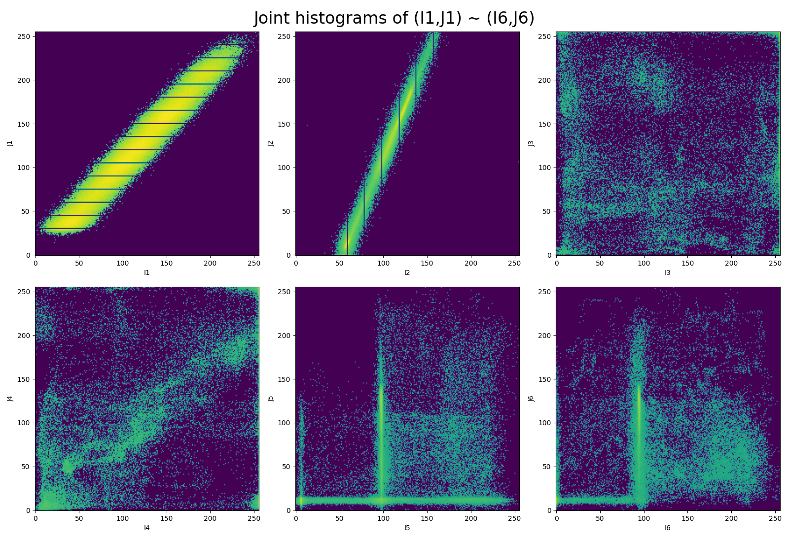

The observations from the plot above align with the pairs of images we have.

In concrete, I1 and J1 are similar in terms of both grayscale intensities and positions, therefore, most points in the histogram center around the line `y = x`, with minor deviations due to the "blurred effect" of J1.

I2 and J2 are also perfectly aligned with respect to pixel positions, but have slightly different grayscale intensities, therefore, we observe a line with a different slope and intercept, while the data points are still closely clustered.

I3/J3 and I4/J4 show the images of two different people. Since the images are less similar to each other, 
data points in the histogram are more scattered around. This pattern is also observed in the last two pairs of images where a slice of brain is shown. However, the details of the brain are greyed out in J5 and J6 using a constant intensity around 100. Consequently, many data points overlap on the vertical line `x = 100`, where the grayscale intensity on the y axis ranges from roughly 10~140, corresponding to the intensity within the brain as in I5 and I6.

Below is the visualization of the histogram on the same data using the `numpy` built-in function `np.histogram2d()`. As we can see, it's almost exactly the same as ours except that the handling of bins is more precise.

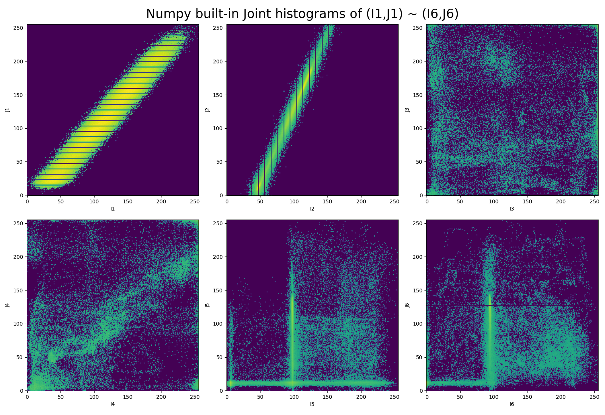

## Part 2: similarity criteria

**Write three functions that calculates the sum squared difference, the Pearson correlation coefficient and mutual information between two images of the same size (no for loops). Test the functions on the different pairs of images and briefly justify.**

Given six pairs of images (I1,J1) ~ (I6,J6), for each pair we calculate the sum of squared difference, Pearson correlation coefficient and mutual information, and print out the results to the console.

```
(I1, J1) sum sqr diff = 16084808
(I1, J1) pearson corr = 0.978182428141388
(I1, J1) mutual info = 1.5549330962837382
---------------------------------------------------
(I2, J2) sum sqr diff = 30364219
(I2, J2) pearson corr = 0.9962134367832854
(I2, J2) mutual info = 2.228748876135049
---------------------------------------------------
(I3, J3) sum sqr diff = 4401503
(I3, J3) pearson corr = 0.14339070113716768
(I3, J3) mutual info = 0.6687586245620837
---------------------------------------------------
(I4, J4) sum sqr diff = 3848301
(I4, J4) pearson corr = 0.5640342309868849
(I4, J4) mutual info = 1.0241532987504278
---------------------------------------------------
(I5, J5) sum sqr diff = 20998301
(I5, J5) pearson corr = 0.6564367191426469
(I5, J5) mutual info = 0.5548820671204602
---------------------------------------------------
(I6, J6) sum sqr diff = 42510000
(I6, J6) pearson corr = 0.7802495447255012
(I6, J6) mutual info = 0.6748563215819838
---------------------------------------------------
```

For testing purposes, we have compared our results to some existing library functions such as `mutual_info_score` from `sklearn.metrics`, all the numbers match up to the 15-th digit precision.

As it turns out, the more similar two images are, the larger the mutual information value is. The first two pairs of images share a lot in common, so the mutual info values are higher. The second pair only differs in grayscale intensities, so this pair has the highest mutual info. In the first pair, J1 is a little blurred, so the mutual info drops a bit. All the other pairs have a significantly lower mutual info because they are much less similar.

The Pearson correlation coefficient fails to detect any non-linear relationship, so it's does not give us 
very useful information. For example, both the third and the fourth pair have different images, so the Pearson coefficient should be close, but it turns out that they differ a lot simply due to random shapes and noises.

The sum of squared difference, in some cases does not seem to be a reliable metric when it comes to image similarity. For example, although the first two pairs of images exactly overlap, the computed SSDs are very high. In fact, I2 is a bit noisier than I1, and J2 is a darker version of J1. It turns out that SSD is relatively sensitive to the overall image intensity, so a small constant change of intensity on every pixel leads to a very large SSD. On the other hand, the next two pairs of images are very different, but they have a much lower SSD just because their overall intensity pattern is similar.

## Part 3: spatial transforms

**Generate a 3D grid of evenly spaced points, implement rigid and affine transform, test and visualize the functions on the 3D point cloud. The transforms must include translation, rotation as well as scaling on all three axes.**

To play with spatial transforms, first we generate a 3D meshgrid of evenly spaced points using `np.mgrid[0:21,0:21,0:5]`, which gives us a 20 x 20 x 4 rectangular prism.

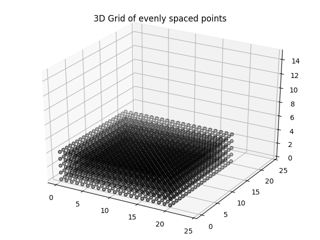

Next, we unravel the meshgrid and vertically stack all three dimensions together, plus a vector of ones and then take the transpose, this will convert it into homogeneous coordinates. Then, we can apply a 4 x 4 transform matrix on every data point to reshape the box, and finally visualize the box.

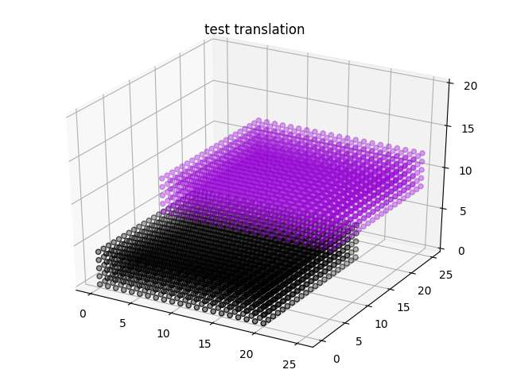

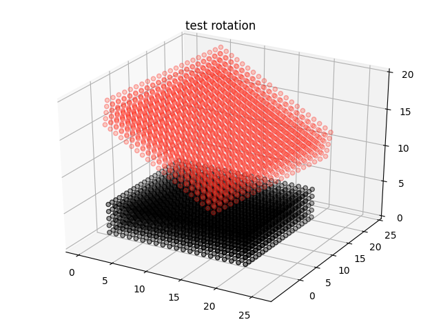

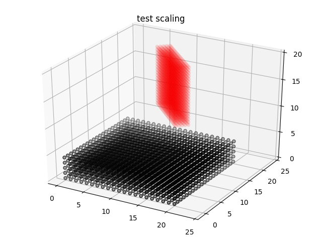

3D rigid and affine transforms in homogeneous form can be represented using 4 x 4 matrices. When applying multiple tranforms on an image, it's convenient to multiply them all together while still preserving the linear transformation properties.

## Part 4: simple 2D registration

**Write a rigid and affine transform function that operates on 2D images. Transformation parameters can be floats, so after transforming the meshgrid, certain interpolation must be applied as appropriate.**

**Implement three versions of gradient descent using SSD as the loss function: considering only translations, only rotations, and both. Test the quality of registration on the provided MRI modality images and describe the observations.**

Following the same idea, now we adapt our 3D spatial transform functions to 2D intensity-based image registration. In specific, we reduce the previous 4 x 4 linear transform matrix to a 3 x 3 matrix, multiply it by every image pixel in homogeneous coordinates, and then apply the interpolation. In order to better fit the relationship between pixel coordinates and grayscale intensities, here we are using the `griddata()` function from `scipy.interpolate`. For the optimization part that uses a naive gradient descent algorithm based on sum of squared difference as the loss function, the objective of image registration is simply to find a vector of transform parameters that minimizes SSD.

It is worth mentioning that our approach is not as fast as existing libraries such as [OpenCV](https://opencv.org/) written in C++. We use a timer decorator to keep track of the execution time. On average, each step takes around 1.5 seconds to update, so a call to gradient descent with 500 iterations will take up to 800 seconds to run. Under the hood, in each step the algorithm first transforms the input image, which incurs an elementwise matrix multiplication on each pixel and the transform matrix as well as an interpolation call, then it calculates the derivative of the SSD loss function, which is also quite computationally expensive. As a result, although we have applied vectorization everywhere without any for loops, the overall performance is not boosted up so much.

As a tentative step, first we did a small test on our implementation. Using `BrainMRI_1.jpg` as the ground truth image, in the figure below we have plotted the transformed image with respect to:

1. translate the image by 20 pixels on both x and y axis
2. rotate the image around the origin (the upper left pixel) by 15 degrees
3. translation of 20 pixels + rotation of 15 degrees

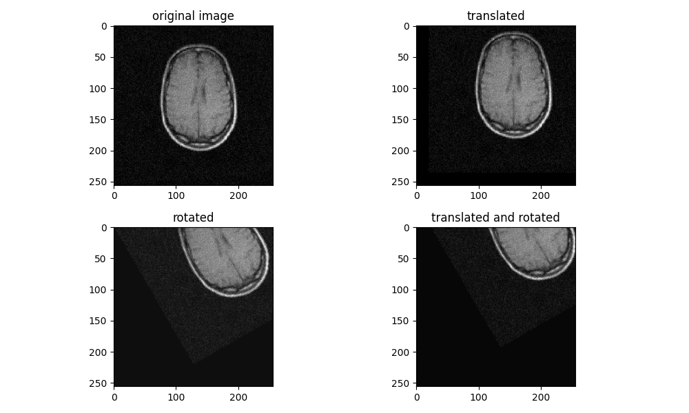

The transform functions work as expected, as we can see from the black edges on the side.

To ensure that the gradient descent is bug-free, we then apply it on translation, rotation and rigid transform respectively. Here are some results:

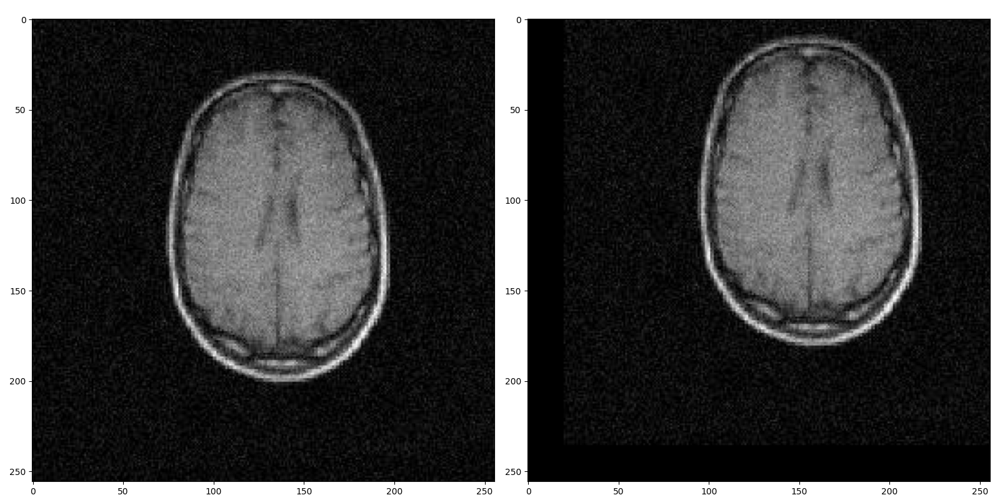

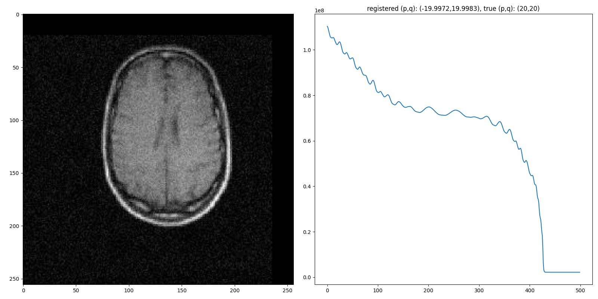

In the two figures above, we have translated the original image by 20 on each axis (first row), and then tried to register it back into the original image (second row). In this case, the quality of registration is pretty good since the registered image perfectly overlaps with the original one. The output parameters of p and q are 19.99, which is very close to the real value of 20. The SSD curve also indicates convergence, overall it is decreasing and then flattens out after around 420 iterations.

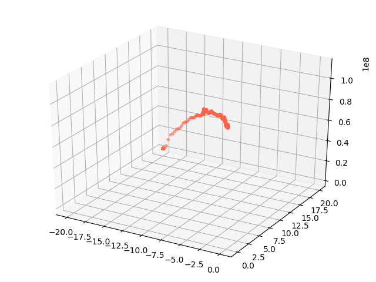

SSD as a function of p and q in the 3D space can be quite complicated, but a path in the scatter plot shows convergence anyway.

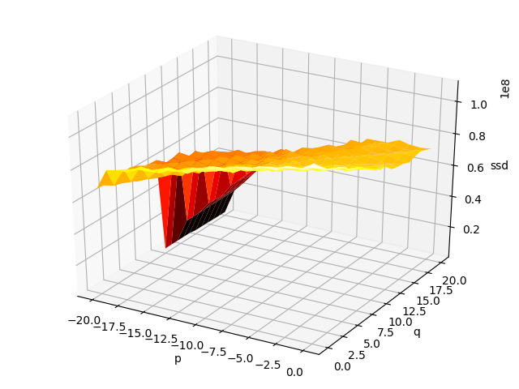

If we use a nearest neighbour interpolation to guess the shape of the function, it may look like this.

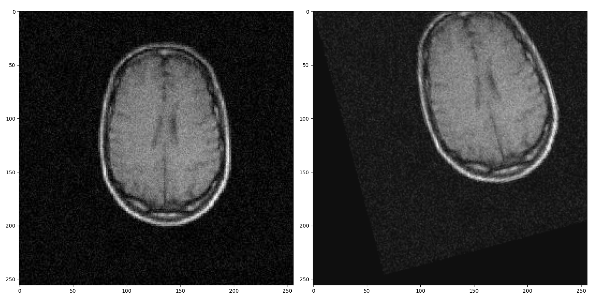

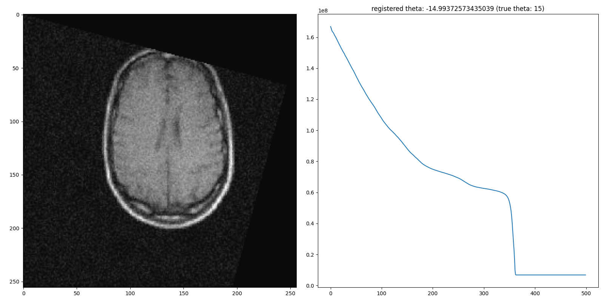

In the two figures above, we have rotated the original image by 15 around the origin (first row), and then tried to register it back into the original image (second row). In this case, the quality of registration is also satisfying since the registered image perfectly overlaps with the original one. The output parameter of theta is 14.99, which is very close to the real value of 15 (clockwise rotation leads to a negative value). The SSD curve also indicates convergence, overall it is decreasing and then flattens out after around 380 iterations.

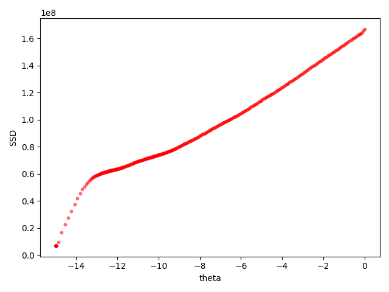

In this rotation-only case, the scatter plot of SSD as a function of theta looks like this. Obviously the relationship is non-linear, but it's much simpler compared to the previous function in 3D space.

Based on this simple unit test, we are confident that our algorithm works correctly.

However, when translation and rotation are applied simultaneously, SSD as a function of both p, q and theta can be much more complex in the 4D space. We cannot graphically illustrate its shape, nor have any idea how it may look like. In fact, the registration quality in this case is not as good as we have seen above.

Now let's formally test our algorithm on the given dataset of the four MRI brain images.

```c++
BrainMRI_1.jpg  // abbreviated as m1, the ground truth image
BrainMRI_2.jpg  // abbreviated as m2, a translated version
BrainMRI_3.jpg  // abbreviated as m3, a rotated version
BrainMRI_4.jpg  // abbreviated as m4, a translated + rotated version
```

The goal here is to find the registration parameters that best fit `m2, m3, m4` onto `m1`.

First, we only consider translations (p and q), the following result is obtained:

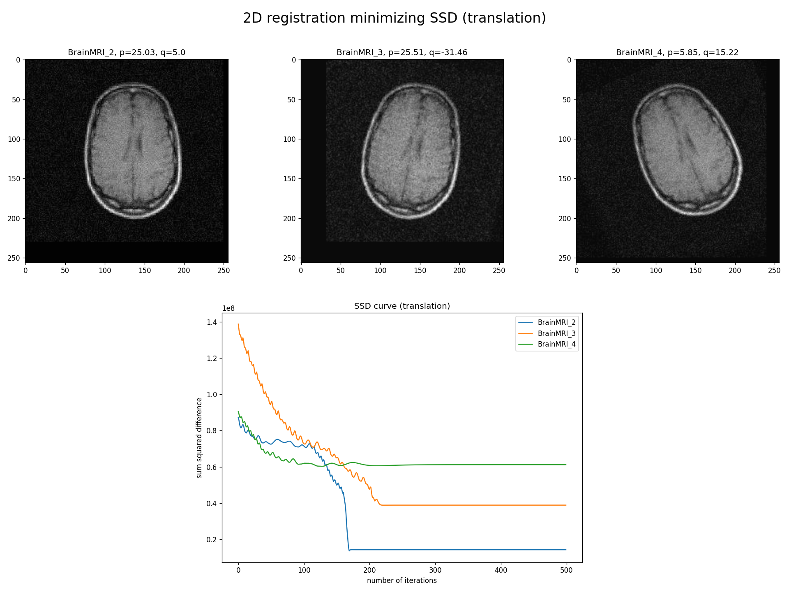

As we can see, only `m2` is perfectly aligned with `m1`, which gives us `p = 25, q = 5`. This is because `m2` only includes translations. On the other hand, `m3` and `m4` are not well matched against `m1`, this is because they are rotated, so that no matter how we translate them in the orthogonal directions, we won't be able to map them onto `m1`. In the SSD curve plot, `m2` decays and then plateaus very quickly after about 170 iterations, where the loss function is almost minimized. In contrast, `m3` and `m4` flatten out at a much higher SSD level and fail to improve anymore.

Next, we only consider rotations (theta), the following result is obtained:

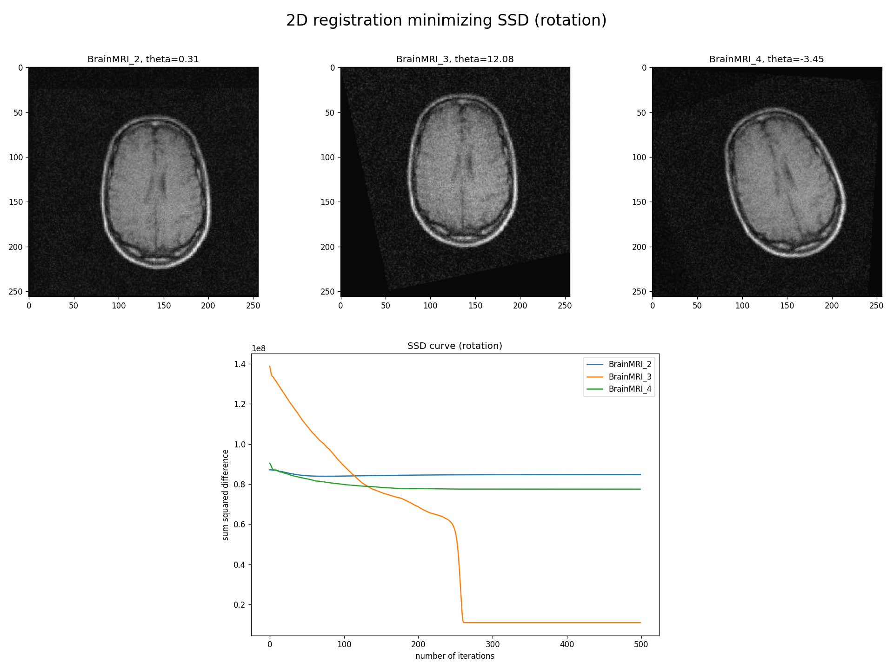

This time, only `m3` is perfectly aligned with `m1`, which gives us `theta = 12.08`. This is because `m3` only includes rotations. On the other hand, `m2` and `m4` are not well matched against `m1`, this is because they include translations, so that no matter how we rotate them round the origin, we won't be able to map them onto `m1`. In the SSD curve plot, `m3` decays and then plateaus very quickly after about 260 iterations, where the loss function is almost minimized. In contrast, `m2` and `m4` are not optimized at all from the very beginning.

Now, we consider both translations and rotations, the following result is obtained:

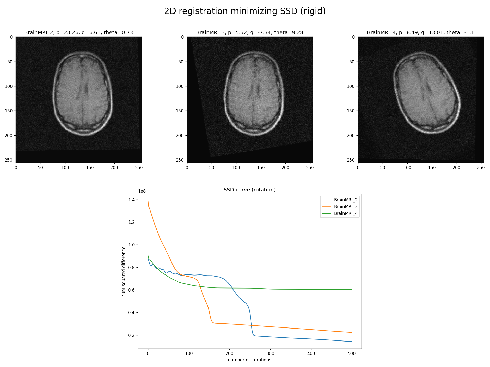This time, both `m2` and `m3` are pretty well aligned with `m1`, but not perfect. In fact, the registration parameters obtained are slightly deviated from the previous results, but the SSD curve still shows convergence. This can be improved to some extent if we increase the number of iterations to 2,000 or 3,000, but it takes hours to run. Overall, the quality of registration is good enough. But why? Well, we know that `m2` only includes translations and `m3` only includes rotations, and from a mathematical perspective, SSD as a function of p, q and theta is complicated. However, in the case of `m2`, theta does not play too much role in that function, similarly, p and q are not significant in the case of `m3`. Hence, in these two cases, the complexity of the SSD function is substantially reduced, so that gradient descent is able to find the optimal parameters much easier.

Unfortunately, the story is very much different for `m4`. `m4` is not well matched against `m1`, this is because it includes both translations and rotations. In this case, the SSD function is much more complex, and convergence is much more difficult.

---

In summation, all these observations must be related to the SSD loss function.

Intuitively, we know that the data of an image is quite arbitrary, so the grayscale intensity as a function of pixel coordinates is quite random, it is not continuous or smooth. Given such image data and a simple SSD similarity metric, there's a good chance that the SSD loss function may not be convex, but very much like a bumpy hillside full of potholes. Our goal is to efficiently search along the hillside to find the deepest hole where SSD drastically drops to zero. Depending on the images we have, the potholes can be randomly distributed, or sparse everywhere, or dense within some ranges of pixels. As a result, there are some cases that we can expect:

- In some steps we might be moving along the direction that has the steepest slope towards a local minimum instead of a global minimum. In the worst case, once we have reached a local minimum then we are stuck there. There's no way to move out since all the first-order partial derivatives around is zero. Therefore, registration will fail. 

- Another point to mention is that, the step size or learning rate of gradient descent is crucial. If the step size is small, convergence can be very slow. If the step size is large, we might bounce around the loss function curve and fail to converge.

- Besides, using the naive SSD as the similarity metric, the magnitude of SSD values can be as large as tens of trillions. Given the formula of SSD, a tiny move can lead to a considerable change in SSD and a very steep gradient. Therefore, in the bumpy hillside metaphor, not only there are many potholes, but also these potholes are very small in size. Even if we choose a very small step size, it is still relatively large compared to the potholes, so a move in that direction can probably result in a bounce.

This explains why the SSD curve is overall decreasing but not strictly decreasing. In fact, I have already tried a number of different learning rates, small enough to make the SSD curve smooth, large enough to converge. The oscillations in certain ranges of the curve are primarily caused by either relatively large step size or extremely steep potholes. **Simply put, the SSD metric is too sensitive.**

It's not hard to see why registration tends to fail in the presence of both translations and rotations. In this case, SSD is a non-convex function of both p, q and theta, its shape can be complicate and suffer from more potholes or saddle points. As a consequence, there's a higher chance that gradient descent would stuck at some saddle points surrounded by a plateau of zero gradients and never be able to escape.

A potential remedy to solve this issue may need to use an adaptive learning rate, adjust the step size based on the amount of change in the loss function, but it's hard to tune. Another way out of this dilemma is to take into account the second order partial derivatives when doing updates, but there's no guarantee that we can find the global optimum if the loss function is non-convex and high dimensional.

---

Finally, we tried to improve our algorithm by adjusting the learning rate, here's the result:

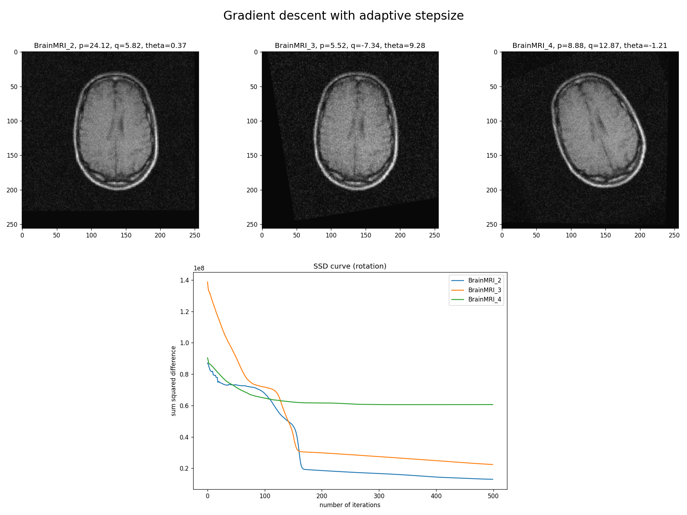This time, although `m2` and `m3` are converging faster, it seems that `m4` is still trapped at some point.

## Part 5: multi-modal alignment

**Given two 3D images from the same subject during the same scanning session, experiment with the FSL libraries to align them.**

Given two 3D medical images `tof.nii` and `t1.nii`, now we use the [FSL libraries](https://fsl.fmrib.ox.ac.uk/fsl/fslwiki/FSL) to do multi-modal alignment. The two modalities differ in spatial resolution (voxel size) as well as field of view (TOF generally only captures a slab of the brain), so we may need to preprocess the images before registration. The good news is, `flirt` will automatically resample the image when doing registration. Here `t1` is the reference image, and we want to correctly superimpose `tof` onto it.

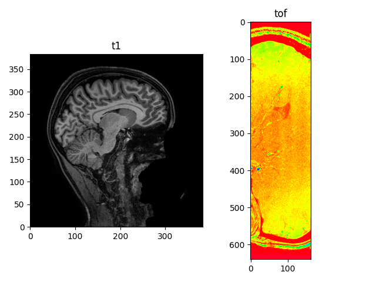

After running this command, we obtain a registered image `tof_in_t1.nii`:

```shell
flirt -in data/tof.nii -ref data/t1.nii -out data/tof_in_t1.nii
```

The field of view and voxel size of the output image `tof_in_t1.nii` is determined by the reference image, so the `flirt` command has converted the two images in the same space for us. If we overlay this output image onto `t1`, the result seems to be a reasonable fit.

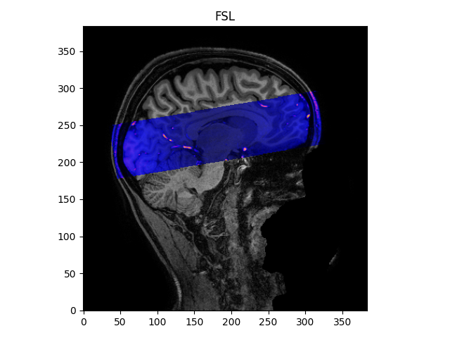
