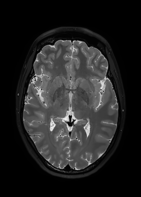

# Lab 4

*Make sure you have [keras]() installed before running this lab*

Image enhancement and segmentation using both mathematical approaches and deep learning techniques.

## Part 1: image enhancement - denoising

**Implement a non-local denoising algorithm such as bilateral filtering, non-local means or a denoising autoencoder, estimate SNR and test your algorithm on the images provided. Do not call functions from libraries such as `scipy` or `dipy`.**

Write something here.




Write something here.


Write something here.

## Part 2: image segmentation

**Implement a segmentation algorithm such as Otsu’s method, watershed transform, region growing, mean-shift clustering and graph-cut, or a neural network model. Test on the images provided and comment on the performance. Do not call functions from libraries such as `scipy` or `dipy`.**

Write sth here.

**1** - Create an ideal time series that represents how the brain should react to the stimulus

<details>
<summary>View code</summary>

```python
# code snippet
```
</details>

## Part 3: vascular segmentation

**Segment arteries from the tof image, veins from the swi image and visualize the result.**

**1. step.**

**2. step.**

Write sth here.