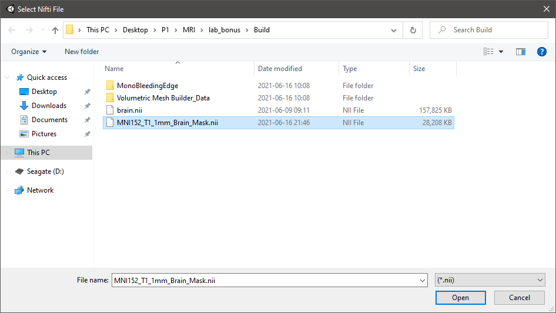

# Lab Bonus - 3D Brain Surface Reconstruction Using Marching Cubes


3D surfaces of the anatomy offer a valuable medical tool for doctors and other viewers. In this lab, we try to reconstruct the brain surface (grey matter) mesh from a preprocessed 3D image volume. Our work for this project is organized into 3 parts: _Nifti Loader_, _Nifti Processor_, and _Unity Gameplay_, each of which is a separate C# namespace.

__Table of Contents__

- [Nifti Loader](#nifti-loader)
- [Nifti Processor](#nifti-processor)
- [Unity Gameplay](#unity-gameplay)
- [Future Improvement](#future-improvement)

## 1. Nifti Loader

### Nifti Header

Inside the `NiftiHeader.cs` script is the `NiftiHeader` class, which holds all the fields of a standard Nifti header. This is basically a clone of the Nifti header specification, as documented on the [Nifti official website](https://nifti.nimh.nih.gov/nifti-1/documentation/nifti1fields).

### Nifti Data

The `NiftiImage` class is responsible for loading the actual Nifti image, and then saves all the relevant information into 3 public properties:

- Header: stores the meta-data of the file using the `NiftiHeader` class
- Data: stores the actual voxel values
- Coordinates: stores the 3D location of each voxel

The constructor takes in a path string of a `.nii` file, opens a file stream on it and attempts to read from the stream one byte at a time. The reading is done in 2 steps: `LoadHeader()` and `LoadData()`. Once the header (the first 352 bytes) has been loaded, we carefully look at every field to make sure our file is in valid format before proceeding. The header is really important, it contains all the information we must know about the image. For example, the dimension of the image, the datatype of the voxel values, how to interpret the space offset, whether an extension is present in the data, and so on. Since the datatype can only be determined at runtime, we need the __Microsoft.CSharp 4.7.0__ package (available on [NuGet](https://www.nuget.org/packages/Microsoft.CSharp/)).

After we have figured out the dimensions and datatype, we proceed to load the actual image data, voxel by voxel. Once finished, we check if the seek pointer is at the end of file. Here, we only support single and double precision floating point numbers. The complete Nifti format supports a far richer set of images, but that's redundant for our simple case.

The last step (optional) is to compute the world space coordinates for each voxel, the Nifti official website mentioned [3 methods](https://nifti.nimh.nih.gov/nifti-1/documentation/nifti1fields/nifti1fields_pages/qsform.html) on this, each fits a different scenario. In our case, we want to know the precise voxel locations in the original __scanner-anatomical__ space, and this falls under *method 2* on the link above, where the calculation details are well documented. In our implementation, we are using the newly released `Mathematics` package from Unity to help us with quaternions and 3x3 matrices multiplication, each computed coordinate is then stored in a `float3`. In fact, this step is optional because we can simply use the data array as our grid space, which implicitly assumes that all voxels are equally spaced on the x,y,z axes. However, depending on how the image was acquired, the spacing between voxels may differ on each axis, so this additional step aims to find more accurate voxel locations that can be used directly in Unity (after scaled by a factor like 0.1 so that the mesh won't be too large).

It is worth mentioning that the image data may need to be byte-swapped in case the endianness of the host CPU architecture is not compatible with the `.nii` file, the Nifti website actually mentioned a way to check this. Most of the time this won't be a problem, unless we are working on high-end servers or reading directly from the internet (network protocols are usually big-endian), but for robustness, we included it in our implementation. There are many ways to get around this, here we used C# reflection to keep the code clean. If inconsistent endianness has been detected, we iterate over every header field (including array fields) to reverse the bytes that were previously read, and then also reverse the order in which we read each voxel value.

### How to use

```c#
public static class NiftiImageTest {
    // uncomment the line below to run the test code in Unity
    [RuntimeInitializeOnLoadMethod]
    public static void Main() {
        var dir = Directory.GetCurrentDirectory();
        var brain = new NiftiImage(Path.Combine(dir, "Assets", "Resources", "brain.nii"));

        // to keep it simple, we use one-dimensional array to store all the voxels data & coordinates,
        // but the 1D array can be treated as if it were a 3D array that represents the 3D volume.
        // we have provided indexer methods that have easy access into both the data & coordinates array

        // the mapping relationship between a scalar index `idx` and an index tuple (i,j,k) is:
        // -----------------------------------------------------------------------------------
        //     i = idx % (Header.dim[1] * Header.dim[2]) % Header.dim[1];
        //     j = (int) ((idx % (Header.dim[1] * Header.dim[2])) / Header.dim[1]);
        //     k = (int) (idx / (Header.dim[1] * Header.dim[2]));
        // -----------------------------------------------------------------------------------
        //     idx = i + j * Header.dim[1] + k * Header.dim[1] * Header.dim[2];
        // -----------------------------------------------------------------------------------

        // e.g. the index number 11418536 and (134, 201, 108) are equivalent, both should return 44
        Debug.Log($"brain.Data[11418536] returns {brain.Data[11418536]}");  // direct access into the array
        Debug.Log($"brain[134, 201, 108] returns {brain[134, 201, 108]}");  // use indexer to access the array

        // use this method to get the world space position of a single voxel
        // the return value is a float3, which requires the Unity Mathematics package
        Debug.Log($"Voxel coordinate: {brain.GetVoxelCoordinate(134, 201, 108)}");

        // if an invalid index is specified, the program will throw the IndexOutOfRangeException and return null
    }
}
```

## 2. Nifti Processor

In the `NiftiProcessor` namespace, we have a static `OtsuThreshold` class for image segmentation, and a static class `MarchingCubes` for generating mesh from our data volume.

### [Otsu's Method](https://en.wikipedia.org/wiki/Otsu%27s_method)

The `OtsuThreshold` class is simple: first it computes the histogram of the 3D volumetric brain image, then finds the intensity threshold that segments the grey matter from the brain. This is done by exhaustively searching for the threshold that minimizes the intra-class variance, which is equivalent to maximizing the inter-class variance for our two classes. Assuming that we only have white matter and grey matter in the image, thresholding is all we need to reliably segment the brain because pixel intensities often vary little within the same human structure. Running the code, our function returns a threshold of 25 for the provided `.nii` image.


__Note: preprocessing steps required__

- [x] Before image segmentation, the brain image must be skull-stripped and denoised first (assume they are already done) using FSL or AFNI. When the skull is also present in the image, the computed threshold may be incorrect because we have 3 classes instead of 2. Also, if the image has not been denoised, we may end up with a biased threshold because thresholding is super sensitive to noise.

- [x] Otsu's method requires us to compute the sum of class probabilities weighted by pixel/voxel values, which can be a huge number. If the image is large, this could possibly lead to integer overflow exceptions. For the provided T1 image whose dimension is 274x384x384, there are more than 40 million voxels to sum over, in fact we are almost hitting the 32-bit integer upper bound of 2,147,483,647, but it's fine. In order to support larger 3D images, a more robust implementation should consider using 64-bit integers or `long` types instead.

### [Marching Cubes](https://people.eecs.berkeley.edu/~jrs/meshpapers/LorensenCline.pdf)

The `GridCube` class holds all configuration of a single cube in the 3D grid, that is, an instance of this class is the cube that we want to _march_. The static `MarchingCubes` class, on the other hand, loops through the entire grid space of our brain volume, initializes a cube at each position, decides how it intersects the brain, then calculates the cut vertices and normals. The code should be self-explanatory with full comments, but here are some key ideas and notes.

1. Given the 3D brain image, our marching cubes algorithm aims to find the array of vertices and triangle indices of the mesh that approximates the corresponding brain surface at the given threshold intensity. Using the grey matter threshold from the previous step, we are able to reconstruct the mesh for the grey matter surface. Once again, the image must be skull-stripped and denoised first to obtain a precise mesh.

2. How to loop through the grid space and how to march the cube is implementation-specific, there are multiple ways to do it. The way we map the grid space to the volumetric brain is that, each of the cube's 8 vertices corresponds to a brain voxel, so a single cube is at the center of 8 adjacent voxels in 3D. For example, if the brain size is 274x384x384, we'd need 273x383x383 cubes to be marched one by one.

3. The lookup tables are copied from [Polygonising a scalar field, by Paul Bourke](http://paulbourke.net/geometry/polygonise/), which is written in C++. I have modified the triangles table into a jagged array, because multidimensional arrays are known to be a lot slower than jagged arrays in C#.

4. The exact position of a cut vertex is linearly interpolated from the two endpoints of a cut edge, as introduced in the original paper. While there exist some implementations that are more robust to floating-point errors, I am simply using the `Vector3.Lerp()` from Unity here.

5. It is optional to calculate the normal vectors manually since Unity has a built-in method `mesh.RecalculateNormals()` for this exact purpose. However, this method is based on a per-triangle basis, the normals are computed as a cross product of two sides of a triangle, so that all 3 vertices share the same normal. Therefore, only flat shading will be applied to individual triangles, resulting in a blocky appearance of the rendered object. Our solution to this problem is to manually compute the surface normal using gradient vectors. A gradient is computed at each cube vertex and is then linearly interpolated to the cut vertices on the edges, just like how cut vertices are interpolated. The only drawback is that gradient vectors cannot be computed for cubes on the border of the grid space, where gradients are mathematically undefined. But still, this would give us a quite nice-looking mesh even if the border cubes are not looked at.

6. To allow for both winding orders (clockwise and counter-clockwise), a boolean parameter is included in the function signature. This is just used to reverse the triangle indices, so that the expected "front" face doesn't get culled.

## 3. Unity Gameplay

In the `Gameplay` namespace, we have a `MenuController` class for UI control, and a `MouseController` class for rotating the brain.


Inside Unity, we've built a simple exhibition room scene with baked lighting maps, and the generated brain mesh will be displayed at the center. When rendering the brain model, only real-time lighting calculations will be applied from a single source of directional light (the culling mask is only set to the brain layer). This is primarily because we want to rotate the brain with our mouse, so it cannot be a static game object. In fact, computing lighting map UVs for such a huge mesh is also quite expensive.

The UI includes a menu panel on the lower right corner with buttons and sliders. On startup, a message box will pop up at the center of the screen to guide the user, some details are:

1. Use the <kbd>Space</kbd> key to toggle on/off the PC specification panel (on the lower left).
2. Use the buttons on the right to step-by-step build mesh from a local Nifti image. A button will appear unclickable (greyed out) until the previous step is complete. If a step is already complete, clicking on that button will have no effect.
3. The upper right panel displays some statistics information such as the FPS and memory allocation.
4. Once the mesh has been built, you can move the slider to change its opacity, or rotate the mesh by dragging the mouse over it.

Clicking on the __load__ button opens up a file browser dialog that asks the user to load a Nifti file. The file must have the extension `.nii`, not `.nii.gz`, as compression format is not handled in the script.



The __segment__ button finds the threshold for the grey matter and caches it in memory. The __mesh__ button builds mesh from the loaded image using marching cubes, this step can take as long as 2 minutes to run since our data is massive. Since the UI events are pretty heavy-duty tasks, we will fire them up as coroutines so as not to block the main event loop. Without the use of coroutines, these event functions will not return until the computation is complete, so the application window is going to freeze and not responding upon the button click. Finally, the slider controls the alpha channel of the mesh vertices color, this is done by using a variant of the Unity standard shader that supports both specular setup and transparency, the default shader will not work.

Here's a screenshot of the brain mesh approximated by the naive marching cubes algorithm. Some part of the surface looks very smooth, some part appear to be slightly discontinuous, but overall the surface outline has been clearly delineated. Note that the memory consumption for mono has reached over 2.4 GB after loading the 40.4 million brain voxels, that's why the computation is slow.


Note: to build the mesh from script in Unity, we must explicitly set the index format to 32 bit, which supports up to 4 billion vertices. The Unity default is 16 bit which only allows a maximum of 65,535 vertices (for performance issues).

```C#
var mesh = new Mesh();
mesh.Clear();
mesh.indexFormat = UnityEngine.Rendering.IndexFormat.UInt32;
```

## 4. Future Improvement

Marching cubes is a very popular algorithm for extracting a polygonal mesh of an iso-surface from a 3D volume. It is widely used in various computer graphics domains, such as medical visualizations and procedural terrains. However, it also comes with a few drawbacks, there's still much room for improvement.

- [] The naive marching cubes algorithm has some ambiguous cases, improving the algorithm can give us a smoother surface. Depending on the underlying voxels data, some resulted surface may not be topologically correct, or even have holes. There exist many literatures that aims at improving the algorithm in this regard, for example [this one](https://people.eecs.berkeley.edu/~jrs/meshpapers/NielsonHamann.pdf), but resolving this problem is not trivial. As an alternative, there's the so-called [Marching tetrahedra](https://en.wikipedia.org/wiki/Marching_tetrahedra) algorithm, which clarifies the ambiguity by cutting the cube with triangular pyramids instead.

- [] As we can see, performance is clearly a bottleneck of our application. The provided image has 40 million voxels, which is a reasonable size for most 3D volumes, but the mc algorithm took nearly 2 minutes to run. Maybe it's hard to do this in real-time, but it's definitely possible to accelerate the algorithm by optimizing out unnecessary calculations. Since we know that may cut vertices are shared by adjacent cubes, caching the result smartly could save us tons of computation power.

- [] While the application of marching cubes is ubiquitous, in the modern game industry, it is often seen running on the GPU side in order to fully leverage the power of parallel processing. In the mc algorithm, we are essentially repeating the same computation for all 40 million cubes, this is what GPUs are really good at because they have hundreds or even thousands of cores. To do so in Unity, we need to move the mc algorithm into a compute shader, use a compute buffer to transfer data between CPU and GPU, and pay attention to every potential cost. A compute shader is written in a syntax similar to the DirectX 11 HLSL language.

## Reference

[1] William E. Lorensen and Harvey E. Cline. 1987. Marching cubes: A high resolution 3D surface construction algorithm. SIGGRAPH Computer graphics. 21, 4 (July 1987), 163–169. DOI: https://doi.org/10.1145/37402.37422

[2] Geometry, Surfaces, Curves, Polyhedra: Polygonising a scalar field, written by Paul Bourke, May 1994, http://paulbourke.net/geometry/polygonise/
