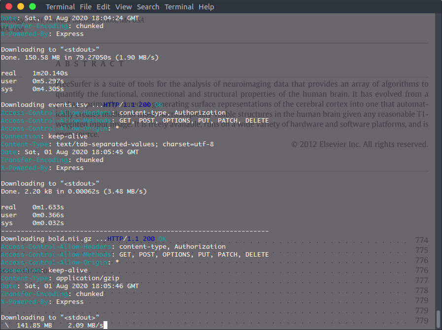
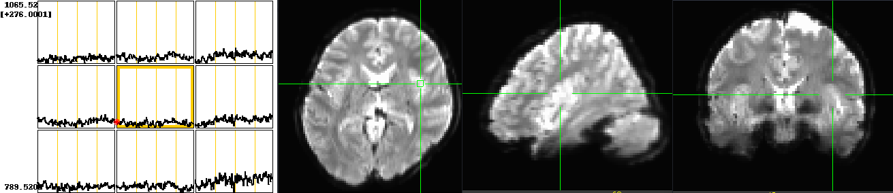
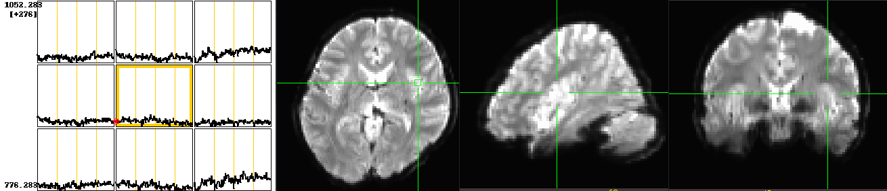
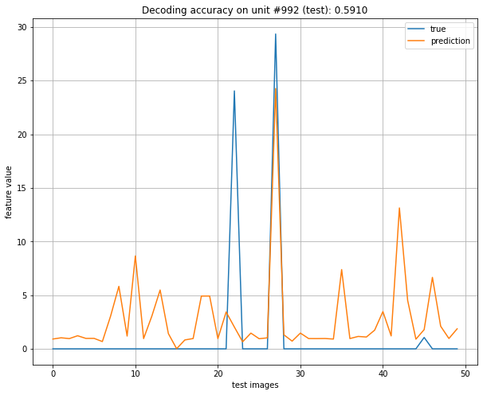
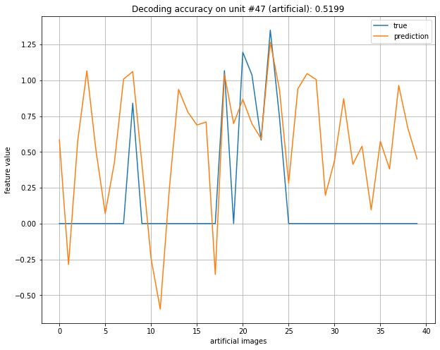
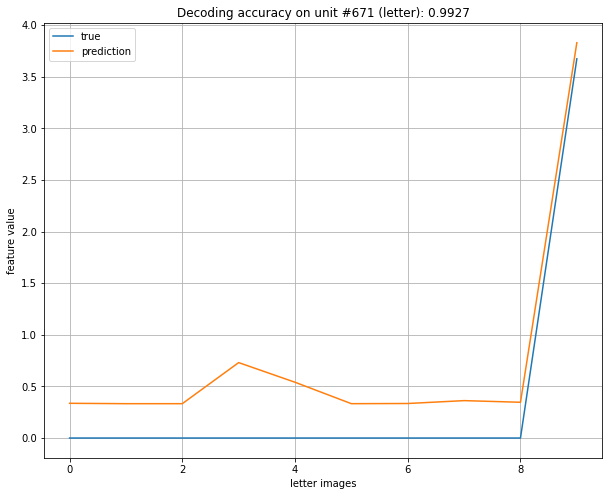
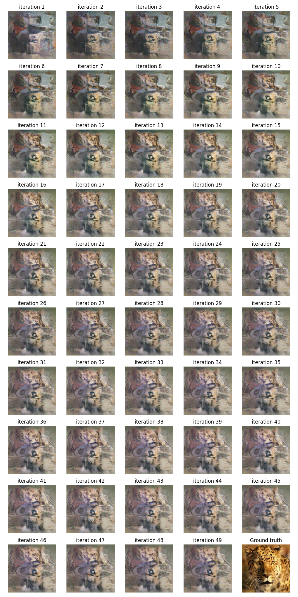

# Lab Final - Visual cortex decoding (mind reading)

Acquiring bold f-MRI images from the brain of a participant who is viewing images or watching a movie sets up an interesting machine learning problem as follows: Given the brain activity (bold f-MRI signal in visual cortex) and a set of images displayed to the subject, train a model that can reconstruct what a person is seeing for some unknown images.

In this lab, we try to reproduce the results of the papers below from the Kamitani Lab, Kyoto University, Japan.

- [Deep image reconstruction from human brain activity](https://doi.org/10.1371/journal.pcbi.1006633)
- [End-to-End Deep Image Reconstruction From Human Brain Activity](https://www.frontiersin.org/articles/10.3389/fncom.2019.00021/full)
- [Generic decoding of seen and imagined objects using hierarchical visual features](https://www.nature.com/articles/ncomms15037)

A plain explanation on Youtube:

- https://www.youtube.com/watch?v=YrO1v7-KcXs&t=9s

**TLDR;**


## Dataset

**For this lab we need two types of data: f-MRI images and the set of stimuli (RGB images)**.

### MRI

The functional MRI data of all 3 subjects is available at [openneuro](https://openneuro.org/datasets/ds001506/versions/1.3.1/).

In a nutshell, there are 4 types of sessions:
- natural images (training): 8 runs per session x 15 sessions = 120 runs in total, 55 stimulus blocks (5 randomly interspersed repetition blocks)
- natural images (test): 8 runs per session x 3 sessions = 24 runs in total, 55 stimulus blocks (5 randomly interspersed repetition blocks)
- artificial images: 10 runs per session x 2 sessions = 20 runs in total, 44 stimulus blocks (4 randomly interspersed repetition blocks)
- letter images: 12 runs per session x 1 sessions = 12 runs in total, 11 stimulus blocks (1 randomly interspersed repetition block)

Data of each run is acquired and stored in the usual nifti format `.nii.gz`, bundled with a `.tsv` file that explains what happens during the run. Peaking into the `.tsv` file, here are the columns we are going to use in this lab.

Column | Info
------------ | -------------
onset | onset time of an event (sec)
duration | duration of the event (sec)
event_type | 1: stimulus presentation block, 2: repetition block, -1,-2,-3: rest blocks 
stimulus_id | stimulus ID of the image presented in a stimulus block ('n/a' in rest blocks)
stimulus_name | stimulus file name of the image presented in a stimulus block ('n/a' in rest blocks)

For more details about the experimental design and MRI acquisition please refer to this [link](https://doi.org/10.1371/journal.pcbi.1006633).

Due to limited hardware capacity on my laptop, here we only use data of the first subject (~30 GB), more disk space is required as we walk through the preprocessing steps. For this lab, I have purchased additional 100 GB data storage on Google Drive to work in the cloud.

### Stimuli

Stimuli images displayed to the subject during the experiment are not available for copyright reasons. In summary, for the training set we have 1,200 natural images, for the test set another 50 natural images. There are also 40 artificial images and 10 letter images, which are used to test how well the model is able to reconstruct images far beyond the training domain.


## Framework

- [MRI data preprocessing](#mri-data-preprocessing)
- [Feature extraction](#feature-extraction)
- [Feature decoding](#feature-decoding)
- [Image reconstruction](#image-reconstruction)

### MRI data preprocessing

The shell script `download.sh` will download all data we need, which takes around 6 hours to run. Depending on the network connection, some data would be lost halfway, so it is necessary to do a sanity check. If everything works well, f-MRI data of the same run should be similar in size (within less than 1 MB of deviation). **Caveat**: in the training set, session 07 has 4 runs, session 08 and 09 each has 10 runs, this may be caused by unexpected issues during the experiment, so we have to manually fix it.



<details>
<summary>View code</summary>

```bash
#!/bin/bash
export LC_ALL=C
CWD=$(pwd)

mkdir data && cd data
mkdir ArtificialImage
mkdir LetterImage
mkdir NaturalImageTest
mkdir NaturalImageTraining

url_folder="https://openneuro.org/crn/datasets/ds001506/snapshots/1.3.1/files"
path1="sub-01:ses-perception"
path2=":func:sub-01_ses-perception"
path3="_task-perception_run-"

# download f-MRI images from openneuro
function download_file {
    session=$1
    run=$2
    img=$3  # ArtificialImage / LetterImage / NaturalImageTest / NaturalImageTraining
    echo "--------------------------------------------------------------------"
    printf "Downloading bold.nii.gz ..."
    time http --download "$url_folder/$path1$img$session$path2$img$session$path3${run}_bold.nii.gz" > $CWD/data/$img/$session$run.nii.gz
    printf "\nDownloading events.tsv ..."
    time http --download "$url_folder/$path1$img$session$path2$img$session$path3${run}_events.tsv" > $CWD/data/$img/$session$run.tsv
}

# handle the interrupt signal in case download or processing is slow
signal_handler() {
        echo
        read -p 'Interrupt? (y/n) [N] > ' answer
        case $answer in
                [yY])
                    kill -TERM -$$  # kill the process id of the script
                    ;;
        esac
}

trap signal_handler INT  # catch signal

# __main__

# download ArtificialImage
for ses in {01..02}  # 2 sessions
do
    for run in {01..10}  # 10 runs
    do
        download_file $ses $run "ArtificialImage"
    done
done

# download LetterImage
for run in {01..12}  # 1 session 12 runs
do
    download_file "01" $run "LetterImage"
done

# download NaturalImageTest
for ses in {01..03}  # 3 sessions
do
    for run in {01..08}  # 8 runs
    do
        download_file $ses $run "NaturalImageTest"
    done
done

# download NaturalImageTraining
# ! for some reason, session 07 has 4 runs, session 08 and 09 each has 10 runs
# ! must fix these downloads manually
for ses in {01..15}  # 15 sessions
do
    for run in {01..08}  # 8 runs
    do
        download_file $ses $run "NaturalImageTraining"
    done
done

wait
```

</details>

As usual, first we use the `pipeline.sh` to clean up the raw bold images, remove large spikes in the time series, perform motion correction, spatially register all bold images to the same template space, and then apply some preprocessing steps such as bandpass filtering, whitening and denoising, here I have only tried to remove frequencies outside a reasonable range. Data normalization will be handled later in the training process so we skip it here. **Caveat**: to prevent exhausted hardware storage, we will delete intermediate files including the raw images as we go, so it is recommended to backup the images before running this script.

<details>
<summary>View code</summary>

```bash
#!/bin/bash

export LC_ALL=C
CWD=$(pwd)

function cleanup {
    local image=$1
    printf "__________(0%%)\r"

    # remove large spikes in time series
    3dDespike -prefix despike_$image $image 2>&1  # redirect stderr to stdout
    [[ $? -eq 0 ]] && printf "++ #########_____________________(33%% completed)\r" || exit 1
    
    # motion correction
    mcflirt -in despike_$image -out mc_$image 2>&1
    [[ $? -eq 0 ]] && printf "++ #####################_________(67%% completed)\r" || exit 2
    
    # compute mean (will be later used to obtain the transform matrix w.r.t. the template)
    3dTstat -prefix mean_$image mc_$image 2>&1
    [[ $? -eq 0 ]] && printf "++ ##############################(99%% completed)\r" || exit 3
    printf "\n\n"
    
    # free disk space to prevent exhausted hardware (only 40 GB available on my laptop)
    # important! must delete these 2 images on the spot, otherwise 97 GB is required
    # if only 1 image is deleted, we still need 60+ GB, hence, we must delete both
    # we then create a fake $image file, which will be used as dummy iterator in the registration loop
    rm $image despike_$image
    touch $image  # dummy file
}

# despike, motion correct the raw bold images
for dir in $(ls -d data/*/)  # command substitution $()
do
    cd $CWD/$dir
    for img in *.nii.gz
    do
        echo "cleaning ${dir}/$img"
        cleanup $img
    done
done

cd $CWD
cp "$CWD/data/ArtificialImage/mean_0101.nii.gz" "$CWD/data/template.nii.gz"
template="$CWD/data/template.nii.gz"  # use the first mean artificial image as template

function register {
    local mean=mean_$1
    local mc=mc_$1
    local xfm=${mean/.nii.gz/.m}  # one-time pattern substitution: ${var/old_str/new_str}

    # for the same subject, a degree of freedom of 6 would suffice (translation + rotation)
    flirt -in $mean -ref $template -out dispose.nii.gz -dof 6 -omat ${mean/.nii.gz/.m}
    flirt -in $mc -ref $template -applyxfm -init $xfm -out reg_$1
    
    # free disk space again after coregistration to prevent exhausted hardware
    rm $1 $mean $mc $xfm dispose.nii.gz
}

# register all bold images to the template space
for dir in $(ls -d data/*/)  # command substitution $()
do
    cd $CWD/$dir
    for img in [0-9]*.nii.gz
    do
        printf "registering ${dir}${img}\n"
        register $img
    done
done

# some other preprocessing steps ...
cd $CWD

for dir in $(ls -d data/*/)
do
    cd $CWD/$dir
    for img in reg_*.nii.gz
    do

        # bandpass filtering
​        3dTproject -prefix clean_$img -input $img -passband 0.01 0.1 >/dev/null
​        rm $img
​    done
done
```
</details>

In [afni](), we can easily verify that all runs all now co-registered into the same space.






Next, in Python we load the `.nii.gz` images into memory one by one, find its associated `.tsv` file to match each slice with a stimulus. Slices corresponding to the same stimulus are averaged across trials to increase the signal-to-noise ratio of the f-MRI signals, so that noise unrelated to visual stimuli can be effectively removed, this gives us a 3D array for each stimulus. Instead of flattening the array into a 2D surface using tools like [freesurfer](https://surfer.nmr.mgh.harvard.edu/fswiki/FreeSurferOccipitalFlattenedPatch), we simply squashes it into a one-dimensional vector because we will work with regression models later. We then save the vector into a large pandas dataframe, indexed by the stimulus (the image file name), serialize the dataframe into binary format and dump to hard disk, this serves to backup the data and help facilitate data manipulation across different scripts and machines.

Since the visual cortex is located near the back of the brain, we have removed the 2/3 of the bold image along the y axis and only used the last 1/3. This further reduces the data size, so that each vector would have a length of 233,472.

**Caveat**:

1. Each slice must be shifted by 4 seconds to compensate for hemodynamic delays.
2. Rows in the `.tsv` file corresponding to rest blocks must be removed, apart from the first and last row, there are some rest blocks in the middle of the run.
3. Not all stimuli are 8 seconds long (some are 12 seconds even in the same run).
4. Some stimuli are repeatedly displayed to the subject within the same run (repetition blocks). However, there are some stimuli that reappear across different runs and even across sessions (for artificial images), so we need to correctly average these blocks as well.

<details>
<summary>View code</summary>

```python
import os
import numpy as np
import pandas as pd
import nibabel as nib


HRF_DELAY = 4  # shift f-mri by 4 secs to compensate for hrf delay
VC = 1 / 3     # use the last 1/3 of the brain along y axis as visual cortex


def clean(folder, outfile):
    """This function slices the f-MRI bold signals
       1. for each stimuli, average across all time slices to obtain a 3D ndarray
       2. flatten out the ndarray into one-dimensional vector
       3. return all vectors as a pandas dataframe, indexed by the stimuli name
       4. serialize the dataframe into binary format, dump to local disk
    """
    if os.path.exists(outfile):
        os.remove(outfile)

    for root, dirs, files in os.walk(folder):
        mri_dict = {}  # a dictionary of {stimuli : slice} pairs

        for file in files:
            if not file.endswith('nii.gz'):
                continue
            else:
                tsv = file[4:8] + '.tsv'

            nii = nib.load(os.path.join(root, file))
            dx, dy, dz, dt = nii.shape
            tr = nii.header.get_zooms()[3]  # repetition time

            y = int(dy * (1 - VC))
            mri = nii.get_fdata()[:, y:, ...]
            print(mri.shape)

            events = pd.read_csv(os.path.join(root, tsv), delimiter='\t').to_numpy()
            events = events[1:-1, ...]  # exclude the first and last row (32s and 6s rest periods)

            for onset, duration, block, _, stimuli, _, _, _ in events:
                if block < 0:  # rest blocks without visual stimulus
                    continue

                a = int((onset + HRF_DELAY) / tr)  # first slice
                z = int(a + duration / tr)         # last slice

                slice = np.mean(mri[..., a:z], axis=3)
                slice = slice.ravel()

                if stimuli in mri_dict.keys():
                    updated_slice = (mri_dict[stimuli][0] + slice) / 2
                    mri_dict.update({stimuli: [updated_slice]})
                else:
                    mri_dict.update({stimuli: [slice]})

        mri_df = pd.DataFrame.from_dict(mri_dict, orient='index', columns=['mri'])
        mri_df.to_pickle(outfile)


def run():
    base_dir = "lab_final/data"

    dir1 = os.path.join(base_dir, 'train')
    dir2 = os.path.join(base_dir, 'test')
    dir3 = os.path.join(base_dir, 'artificial')
    dir4 = os.path.join(base_dir, 'letter')
    dirs = [dir1, dir2, dir3, dir4]

    for folder in dirs:
        filename = os.path.split(folder)[1] + '.bold.pkl'
        outfile = os.path.join(base_dir, filename)
        clean(folder, outfile)
```
</details>


### Feature extraction

To train a model that can effectively decode image features from the f-MRI bold signals, first we need to know the true image features of the training set. This can be achieved by passing the training images to a pre-trained convolutional neural network which is good at extracting useful features from images, so basically we will build a model by leveraging the power of transfer learning.

There are several choices to pick from such as AlexNet and ResNet, but here we are using the keras implementation of [VGG19](https://keras.io/api/applications/vgg/), which won the ImageNet Challenge in 2014. This model consists of 16 convolutional layers and 3 fully connected layers, it was pre-trained with images on [ImageNet](http://www.image-net.org/) to classify images into 1,000 object categories.


As a fixed feature extractor, we wrap VGG19 into an `Extractor` class and write an `extract()` method. Once we create an instance of it, we can iteratively extract features on every image. In VGG19, all visual images were resized to 224x224 pixels and fed to the model. Since objects may be more suitably represented using high-level visual features which are invariant to image differences caused by translation or rotation, we discard the 3 fully connected layers and the softmax linear classifier, only take the output from the last convolutional layer (after downsampling in the max pooling layer), thus, the dimension of the original data space will be reduced to a new feature space of shape `(7, 7, 512)`, while the high-level features are mostly reserved. We then flatten this feature array into a vector as well.

Given the small size of our training set (1,200 images), it would be unrealistic to train a useful model if the output is very high-dimensional (7x7x512 = 25,088). Hence, we randomly select 1,500 values from the feature vector as our true features. After that, once again we save them in a pandas dataframe and dump to hard drive.

 **Caveat**: By randomly choosing 1,500 feature units from the complete 7x7x512 _conv5_4_ max pooling layer, we are assuming that each unit (at least some units) carries some useful information of the image **across all images**. It makes no sense at all if every image selects a different set of 1,500 positions from the feature space represented by the pooling layer, so we must enforce the same 1,500 positions each time by explicitly calling `np.random.seed()` before `np.random.permutation()`.

<details>
<summary>View code</summary>

```python
import os
import numpy as np
import pandas as pd

from tensorflow.keras.applications.vgg19 import VGG19
from tensorflow.keras.preprocessing import image
from tensorflow.keras.applications.vgg19 import preprocess_input
from tensorflow.keras.models import Model


class Extractor:
    """Image features extractor on a specified layer"""
    def __init__(self, layer='block5_pool'):
        self._base = VGG19(include_top=False, weights='imagenet')
        self._model = Model(inputs=self._base.input,
                            outputs=self._base.get_layer(layer).output)
        self._seed = 0

    def __str__(self):
        return self._model.summary()

    def extract(self, path, n_features=5000):
        """Return features as an ndarray of shape (n_features,)"""
        assert n_features < 25088, 'features amount out of bound'  # total = 7x7x512 = 25088
        img = image.load_img(path, target_size=(224, 224))
        x = image.img_to_array(img)
        x = np.expand_dims(x, axis=0)
        x = preprocess_input(x)

        features = self._model.predict(x)
        features = features.reshape(-1, 7*7*512)
        self._seed = np.random.seed(2501)  # important! must select the same n_features points each time!
        indices = np.random.permutation(7*7*512)
        features = features[0][indices]  # shuffle features
        return features[:n_features]


def extract_features(model, folder, n_features=1000, outfile=None):
    if os.path.exists(outfile):
        os.remove(outfile)

    for root, dirs, files in os.walk(folder):
        features = []
        for f in files:
            feat = model.extract(os.path.join(root, f), n_features=n_features)
            features.append(feat)

        df = pd.DataFrame({'conv5': features}, index=files)
        df.to_pickle(outfile)


def run():
    n_features = 1500
    work_dir = 'lab_final'

    dir1 = os.path.join(work_dir, 'images/train')
    dir2 = os.path.join(work_dir, 'images/test')
    dir3 = os.path.join(work_dir, 'images/artificial')
    dir4 = os.path.join(work_dir, 'images/letter')
    dirs = [dir1, dir2, dir3, dir4]

    out = os.path.join(work_dir, 'features')
    if not os.path.exists(out):
        os.makedirs(out)

    opener = Extractor('block5_pool')

    for folder in dirs:
        filename = os.path.split(folder)[1] + '.pkl'
        outfile = os.path.join(out, filename)
        extract_features(opener, folder, n_features, outfile)
```
</details>

### Feature decoding

In this part, we will train a model that takes in an f-MRI image slice and outputs a feature vector. That is, based on the visual cortical activity measured by f-MRI, we would like to decode the features of viewed images. Ideally, the decode feature vector should be very close to the true feature vector we extracted from VGG19, but this is challenging. After some research, we decide to try sparse linear regression which the authors have used in the papers: the sparse linear regression algorithm (SLR), which can automatically select important voxels for decoding by introducing sparsity into a weight estimation through Bayesian estimation of parameters with the automatic relevance determination (ARD) prior.

For example, say we have 1,200 samples, both the f-MRI signals and the true features extracted from VGG19 have been squashed into a single vector, so the input `X` (f-MRI) has a shape of `(1200, n_voxel)`, and the output `Y` (features) has a shape of `(1200, n_unit)`, where `n_voxel` is the total number of voxels (on the order of 200,000 for the visual cortex region) and `n_unit` represents the 1,500 units we previously selected from the complete feature vector. It is clear to see that the number of features is relatively large compared to the samples we have, there are way too many parameters to estimate with very little data available. As a result, some vanilla versions of machine learning models such as linear regression, logistic regression and neural network would fail, but this is where SLR comes into play.

SLR does feature selection very much like how Lasso regression penalizes variables, the optimized solution is sparse, meaning that many coefficients at the end of the day would become 0. In SLR, the level of sparsity is controlled by explicitly specifying the number of voxels we want to keep, say 1,500, and it will automatically select 1,500 voxels which are most correlated to a feature unit. If the number is too small (highly sparse), we are at the risk of considerable feature loss, if it's too large, the model is susceptible to underfitting since we only have 1,200 samples, not to mention that the millions of parameters can easily lead the model to explode with infinite computational cost.

In our case, we apply SLR unit by unit in a for loop. In the first iteration, we look at the first column of `Y` (the first feature unit), which is a vector of shape `(1200,1)`, select the top 1,500 columns (voxels) of `X` that are most correlated with it, and then train a SLR model on them. We do this for all 1,500 feature units, each time a different subset of voxels is selected, so the whole model would contain 1,500 SLR models inside. During prediction, we also work in a unit-wise manner, decode the values of individual units in the feature vectors, and then merge the results.

**Caveat**:

- [x] Data normalization must also be done in a feature-wise manner, voxel by voxel, or unit by unit, so as to remove outliers in each dimension and center data around 0.
- [x] During normalization, the `divide by zero` exception must be handled since we expect to have many zeros in the array. After prediction, the predicted values must be de-normalized to the original feature space.
- [x] Large values of `n_voxel` and `n_unit` would immediately lead the model to underfit.
- [x] During voxel selection, we need to compute correlations between a `(1200, n_voxel)` matrix and a `(1200, 1)` array, this is the most expensive computation in this project. In the authors' original implementation, this is done by calling `np.corrcoef()` under the hood which computes a large covariance matrix and then return values on a corner of the diagonal, but the memory usage can easily explode because `n_voxel` is usually between 200,000 ~ 800,000. I tested the function on my laptop (CPU only Ubuntu 16.04) as well as in Google Colab (GPU enabled + 12.5 GB RAM), in both cases the session crashed and errored out with `MemoryError: Unable to allocate array with shape ...`, so the kernel was running out of RAM. I finally managed to work around this by using a different approach found on [stackoverflow](https://stackoverflow.com/questions/42677677/python3-computationally-efficient-correlation-between-matrix-and-array) and opened an issue in the author's repository.
- [x] The computed correlations array contains many NaNs since there are many zeros in the data, by default, `numpy` considers NaN to be the largest number so that sorting the array by correlation contributions would mess it up. We must use `np.isnan()` to check NaNs and mark them as 0.

<details>
<summary>View code</summary>

```python
import os, sys
import numpy as np
import pandas as pd
import matplotlib.pyplot as plt

from bdpy.ml import add_bias
from bdpy.stats import corrcoef
from bdpy.preproc import select_top
from scipy import stats
from slir import SparseLinearRegression


def corr2_coeff(x, y):
    """A magic function for computing correlation between matrices and arrays.
       This code is 640x+ faster on large dataset compared to np.corrcoef().
       ------------------------------------------------------------------
       author:  Divakar (https://stackoverflow.com/users/3293881/divakar)
       url:     https://stackoverflow.com/questions/42677677
       ------------------------------------------------------------------
    """
    # input arrays subtract row-wise mean
    x_sub_mx = x - x.mean(1)[:, None]
    y_sub_my = y - y.mean(1)[:, None]

    # sum of squares across rows
    ssx = (x_sub_mx ** 2).sum(1)
    ssy = (y_sub_my ** 2).sum(1)

    return np.dot(x_sub_mx, y_sub_my.T) / np.sqrt(np.dot(ssx[:, None], ssy[None]))


class Decoder:
    """Decode features from fmri bold signals, unit by unit, each using a different SLR model.
       for each feature unit (column), select a subset of voxels that contribute most to the unit,
       this 2D subset is then compared to the 1D unit vector to train the model in that unit.
       -------------------------------------------
       fmri_subset:  shape = (n_samples, n_voxels)
       feature_unit: shape = (n_samples, 1)
       -------------------------------------------
    """
    def __init__(self, n_voxel=1500, n_iter=200):
        self.x_train = None  # array_like, shape = (n_sample, n_voxel)
        self.y_train = None  # array_like, shape = (n_sample, n_unit)
        self.n_voxel = n_voxel  # number of voxels to keep (control the sparsity level)
        self.n_iter = n_iter  # number of iterations

        # recall that units are randomly taken from the last convolutional layer
        self.n_unit = 0  # number of units in a feature vector

        self.models = []          # list of sparse linear regression models for each feature unit
        self.subset_indices = []  # list of selected voxel indices for each feature unit
        self.normal_terms = []    # list of (mu, std) tuples for each feature unit (to de-normalize y)

    def fit(self, x_train, y_train):
        self.x_train = x_train
        self.y_train = y_train
        self.n_unit = y_train.shape[1]

        # normalize mri data x (along each voxel)
        mu = np.mean(self.x_train, axis=0)
        std = np.std(self.x_train, axis=0, ddof=1)
        std[std == 0] = 1
        self.x_train = (self.x_train - mu) / std

        # for each feature unit train a sparse linear regression
        for i in range(self.n_unit):
            feature_unit = self.y_train[:, i]
            print(f'start training on unit {i}')

            # normalize image features y (along each unit)
            # this must be done separately because we need to de-normalize later
            mu = np.mean(feature_unit, axis=0)
            std = np.std(feature_unit, axis=0, ddof=1)
            std = 1 if std == 0 else std
            feature_unit = (feature_unit - mu) / std
            self.normal_terms.append((mu, std))

            # voxel selection, select the top `n_voxel` voxels with highest correlations
            # corr = corrcoef(feature_unit, x_train, var='col')
            corr = corr2_coeff(feature_unit.reshape((-1, 1)).T, x_train.T).ravel()
            corr[np.isnan(corr)] = 0  # mark np.nan values as 0 contribution
            x_train_subset, subset_index = select_top(x_train, np.abs(corr), self.n_voxel, axis=1, verbose=False)

            # add bias terms
            x_train_subset = add_bias(x_train_subset, axis=1)

            # set up the model
            model = SparseLinearRegression(n_iter=self.n_iter, prune_mode=1)

            # train model parameters
            try:
                model.fit(x_train_subset, feature_unit)
                self.models.append(model)
                self.subset_indices.append(subset_index)
            except:
                self.models.append(0)
                self.subset_indices.append(0)

    def predict(self, x_test, y_test):
        y_predict = np.zeros_like(y_test)  # shape = (n_sample, n_unit)
        corrs = []  # list of pearson correlations for each unit

        for i in range(self.n_unit):
            true_features = y_test[:, i]
            model = self.models[i]
            unit_status = 'valid' if model != 0 else 'invalid*****'
            print(f'start predicting on unit {i} ({unit_status})')

            # feature prediction
            if unit_status != 'valid':  # SLR failed in this unit
                prediction = np.zeros(true_features.shape)
            else:
                x_test_subset = x_test[:, self.subset_indices[i]]
                x_test_subset = add_bias(x_test_subset, axis=1)
                prediction = model.predict(x_test_subset)
                mu, std = self.normal_terms[i]
                prediction = prediction * std + mu  # de-normalize

            corr, p_value = stats.pearsonr(prediction, true_features)
            corr = 0 if np.isnan(corr) else corr
            corrs.append(corr)

            y_predict[:, i] = prediction

        return y_predict, corrs


def run():
    # configuration
    work_dir = 'lab_final'
    # work_dir = '/content/drive/My Drive'  # if run in Google Colab

    out = os.path.join(work_dir, 'features')
    if not os.path.exists(out):
        os.makedirs(out)

    mri = os.path.join(work_dir, 'data/train.bold.pkl')
    features = os.path.join(work_dir, 'features/train.pkl')

    # load dump files
    x = pd.read_pickle(mri).sort_index(axis=0)
    y = pd.read_pickle(features).sort_index(axis=0)

    def validate(x, y, label='train'):
        """Make sure the two pandas dataframes exactly match in size and order"""
        n_samples = len(x)
        indices = x.index.to_numpy()
        suffix = {'train': '.JPEG', 'test': '.JPEG', 'artificial': '.tiff', 'letter': '.tif'}
        indices += suffix[label]

        assert len(x) == len(y), 'number of samples does not match...'
        assert np.sum(y.index.to_numpy() == indices) == n_samples, 'order of indices does not match...'
        return n_samples, indices

    n_samples, indices = validate(x, y)

    # this lambda function de-serializes a pandas dataframe in the specified column
    # previously in the dumped dataframe, each feature vector has been wrapped as a single object,
    # so that the dataframe only has 1 column 'feature', instead of thousands of columns.
    # but now we need to unwrap the object and expand the features to obtain an ndarray.
    de_serialize = lambda df, col: np.vstack([row for row in df[col].to_numpy()])

    x_train = de_serialize(x, 'mri')    # array of bold signal vectors
    y_train = de_serialize(y, 'conv5')  # array of feature vectors

    # train model
    decoder = Decoder(n_voxel=200, n_iter=10)
    decoder.fit(x_train, y_train)

    # main
    test_combo = ['test', 'artificial', 'letter']

    for label in test_combo:
        mri = os.path.join(work_dir, f'data/{label}.bold.pkl')
        features = os.path.join(work_dir, f'features/{label}.pkl')
        outfile = os.path.join(work_dir, f'features/{label}.decode.pkl')

        dfx = pd.read_pickle(mri).sort_index(axis=0)
        dfy = pd.read_pickle(features).sort_index(axis=0)

        n_samples, indices = validate(dfx, dfy, label=label)
        print(f'number of {label} samples: {n_samples}')

        x = de_serialize(dfx, 'mri')
        y = de_serialize(dfy, 'conv5')

        # decode features
        y_predict, corrs = decoder.predict(x, y)

        # evaluate accuracy
        f, ax = plt.subplots()
        ax.plot(corrs)
        ax.set(xlabel='feature unit', ylabel='Pearson correlation',
               title=f'overall accuracy: {np.mean(corrs)}')
        ax.grid()
        plt.savefig(os.path.join(work_dir, f'result/{label}_feat_corr.png'))
        plt.show()

        # serialize and dump to disk
        if os.path.exists(outfile):
            os.remove(outfile)

        y_predict = [[row] for row in y_predict]
        df = pd.DataFrame({'conv5': y_predict}, index=indices)
        df.to_pickle(outfile)
```
</details>

I'm not able to run the code above with only 8 GB memory on my laptop, any attempt will be killed by the operating system. I tested it on Google Colab with GPU enabled, the training process took around 4 hours to finish, then the model was applied on the test images, artificial images and letter images respectively to predict the features.

To evaluate the quality of our prediction, the feature values of some random unit across images are visualized in the figures below, and we measure feature decoding accuracy as the Pearson correlation coefficient between the prediction and true feature in that unit. The result is not perfect but somewhat reasonable, there are a lot of fluctuations along the horizontal axis because the true feature of many images in a given unit is equal to zero, only some of the randomly selected 1,500 units carry rich information of the image features. The correlation on letter images is 0.9927, which is too optimistic given that we only have 10 data points (10 letter images for test).







Overall, the result falls short of our expectation, I've tried other versions of regression models but none of them makes much of a difference. With as few as 1,200 samples, it's hard to make accurate predictions while the dimension of explanatory variables or features is so high. There might be some models or techniques such as bootstrapping that address the issue, but I think the most fundamental solution is to increase the size of training data. If our model could effectively predict artificial and letter images as well, that would to some extent imply the possibility of generalization to other classes of images, but at this point there's really nothing we can conclude.


### Image reconstruction

Once the features have been decoded, we can then forward them to the reconstruction model to generate an image. In this part, we have referenced the [L-BFGS](https://en.wikipedia.org/wiki/Limited-memory_BFGS) image reconstruction algorithm in this [iCNN package](https://github.com/KamitaniLab/icnn), the basic idea is to train another CNN model that can reconstruct an image such that the CNN features of the reconstructed image in each layer are close to the features we have.

Since we failed to precisely decode the image features in the previous part, it is not possible to reconstruct naturally looking images using whatever techniques, but L-BFGS is a nice algorithm to play with, so I played it on my machine. The algorithm requires an Caffe implementation of VGG19 and DGN, it took me a while to successfully set up OpenCV and Caffe on my laptop. At this point, the package only supports Python 2.7 which is not compatible with recent versions of OpenCV and Caffe, so I modified several places in the source code to work with Python 3. Without GPU power, it takes about 50 minutes to reconstruct an image (500 iterations).

Given the decoded features of a 224x224x3 image of a leopard, the generated image after every 10 updates are drawn below. At first the image is hardly recognizable, but after several iterations some clear features of an animal start to emerge. On the last row, we can find a lot similarities between the reconstructed image and the ground truth. Here I'm only using features from the last convolution layer, but the original code uses all layers from VGG19, which seems to produce better result.




## Reference

[1] Shen G, Horikawa T, Majima K, Kamitani Y (2019) Deep image reconstruction from human brain activity. PLoS Comput Biol 15(1): e1006633. https://doi.org/10.1371/journal.pcbi.1006633

[2] VGG16 and VGG19 from Keras - https://keras.io/api/applications/vgg/

[3] Horikawa, T., Kamitani, Y. Generic decoding of seen and imagined objects using hierarchical visual features. _Nat Commun_**8,** 15037 (2017). https://doi.org/10.1038/ncomms15037

[4] Sample code for Generic Object Decoding and L-BFGS Deep Image Reconstruction @ [Kamitani Lab](https://github.com/KamitaniLab/DeepImageReconstruction)

[5] Shen G, Dwivedi K, Majima K, Horikawa T and Kamitani Y (2019) End-to-End Deep Image Reconstruction From Human Brain Activity. *Front. Computer. Neuroscience*. 13:21. https://doi.org/10.3389/fncom.2019.00021